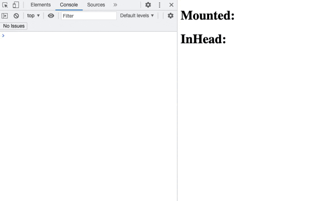

# In Head style sheet for Jetpack Compose

This demonstrates the use of a Compose StyleSheet directly in the head element rather than being mounted as part of the
Compose tree.

It is a companion project to [Compose-JB issue #1207](https://github.com/JetBrains/compose-jb/issues/1207).

This demo shows the difference in number of composition between the 2 solutions.
**Note that composition is slowed down to one pass per second** to make the difference understandable by our primitive eyes
&  brains.

- The classic mounted solution triggers:
  - 2 composition at creation with the first with style classes not rendered
  - 2 composition on creation of a new style class with the first with the new style class not rendered.
- The in-head solution triggers:
  - 2 composition at creation with style classes immediately rendered
  - 1 composition on creation of a new style class with the new style class immediately rendered.

Note that "creation of a new style class" happens only on first color change (because the style class with the new
color does exist yet).

